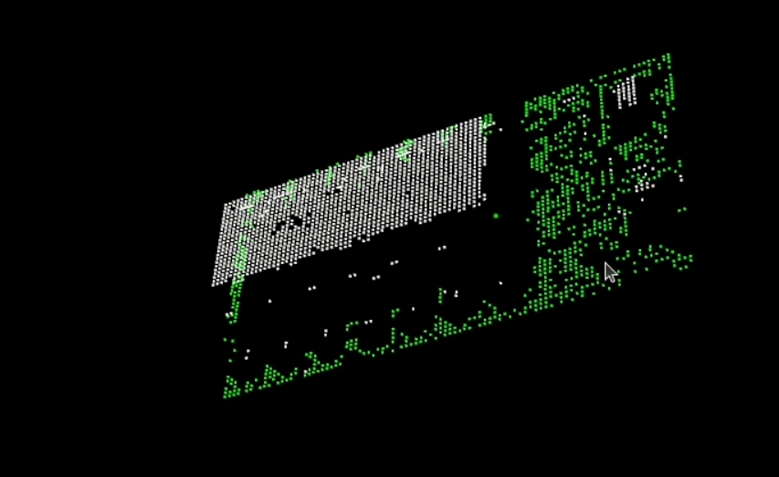
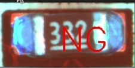

1. 错件：应该贴A型号的，结果贴了B型号。通过2D的形式进行检测，例如OCR。
2. 反件：元器件贴反了。对极性的地方，利用2D的方法，判断其方向，例如灰度图。
3. 浮高：元器件高了或者一侧高一侧低。高度指标：高度最大值，高度均值。两点高度检测。
4. 丝印：元器件类型错了，通过OCR检测元器件类型。
5. 立碑：元器件没有焊上或者贴上，立起来了。
6. 漏件：2D或者3D都可以检测。高度异常，缺少丝印，2D检测。
7. 偏移：元器件的位置与基准位置的差距。
8. 翘脚：深度图颜色的阈值。 

示例：

## 正常焊盘

## 偏移

## 偏移

## 焊盘检测

## 浮高

